# 🚀 Deploy React App to AWS EC2 with Nginx + SSL + GitHub Actions (CI/CD)

## 🖥️ 1. Spin up an EC2 Instance
- Launch an **Ubuntu EC2** instance from AWS Console.  
- Open **Security Groups** and allow:
  - `80` (HTTP) 🌐
  - `443` (HTTPS) 🔒
  - `22` (SSH) 🔑

---

## 📦 2. Install Dependencies on EC2
```bash
sudo apt update && sudo apt upgrade -y
sudo apt install nginx certbot python3-certbot-nginx nodejs npm git -y
```

---

## ⚛️ 3. Build React App
On your EC2 or locally:
```bash
npm install
npm run build   # creates dist/ folder (if Vite) or build/ (if CRA)
```

Copy output to web root:
```bash
sudo rm -rf /var/www/html/*
sudo cp -r dist/* /var/www/html/
```

---

## 🌐 4. Configure Nginx
Edit site config:
```bash
sudo nano /etc/nginx/sites-available/reactapp
```

Paste this:
```nginx
server {
    listen 80;
    server_name ranjeetkumar.tech www.ranjeetkumar.tech;

    root /var/www/html;
    index index.html;

    location / {
        try_files $uri /index.html;
    }
}

server {
    listen 443 ssl;
    server_name ranjeetkumar.tech www.ranjeetkumar.tech;

    ssl_certificate /etc/letsencrypt/live/ranjeetkumar.tech/fullchain.pem;
    ssl_certificate_key /etc/letsencrypt/live/ranjeetkumar.tech/privkey.pem;

    root /var/www/html;
    index index.html;

    location / {
        try_files $uri /index.html;
    }
}

server {
    listen 80;
    server_name ranjeetkumar.tech www.ranjeetkumar.tech;
    return 301 https://$host$request_uri;
}
```

Enable config:
```bash
sudo ln -s /etc/nginx/sites-available/reactapp /etc/nginx/sites-enabled/
sudo nginx -t
sudo systemctl restart nginx
```

---

## 🔒 5. Setup SSL with Let’s Encrypt
```bash
sudo certbot --nginx -d ranjeetkumar.tech -d www.ranjeetkumar.tech
```

---

## 🌍 6. Point Domain to EC2
In your domain registrar:
- Use **AWS Route53 nameservers**  
- Add records:  
  - `A` → `@` → EC2 Public IP  
  - `CNAME` → `www` → `@`

Check:
```bash
dig +short ranjeetkumar.tech
dig +short www.ranjeetkumar.tech
```

---

## ⚡ 7. Setup CI/CD with GitHub Actions
### 🔑 a) Generate SSH Key
On local:
```bash
ssh-keygen -t ed25519 -C "github-deploy" -f github-deploy-key
```
- Copy **public key** → EC2 → `~/.ssh/authorized_keys`  
- Add **private key** to GitHub Secrets → `EC2_SSH_KEY`  

Also add:
- `EC2_HOST` → your EC2 public IP  
- `EC2_USER` → `ubuntu`

---

### ⚙️ b) Create Workflow  
📂 `.github/workflows/deploy.yml`

```yaml
name: Deploy React to EC2

on:
  push:
    branches: [main]

jobs:
  deploy:
    runs-on: ubuntu-latest

    steps:
      - name: Checkout repo
        uses: actions/checkout@v3

      - name: Install Node.js
        uses: actions/setup-node@v3
        with:
          node-version: '20'

      - name: Install dependencies
        run: npm install

      - name: Build React app
        run: npm run build

      - name: Deploy to EC2
        uses: appleboy/ssh-action@v0.1.10
        with:
          host: ${{ secrets.EC2_HOST }}
          username: ${{ secrets.EC2_USER }}
          key: ${{ secrets.EC2_SSH_KEY }}
          script: |
            sudo rm -rf /var/www/html/*
            cp -r dist/* /var/www/html/
            sudo systemctl reload nginx
```

---

## ✅ 8. Deploy & Test
1. Commit and push to `main` branch:  
   ```bash
   git add .
   git commit -m "CI/CD setup"
   git push origin main
   ```
2. Check **Actions tab** in GitHub.  
3. Visit 🌐 `https://ranjeetkumar.tech` — your changes are live! 🎉  

---

## 📊 9. Visual Pipeline (Mermaid)

```mermaid
flowchart TD
    A[Push code to GitHub] --> B[GitHub Actions Workflow]
    B --> C[Build React app]
    C --> D[Deploy dist/ to EC2]
    D --> E[Nginx serves app with SSL]
    E --> F[User visits domain ✅]
```
